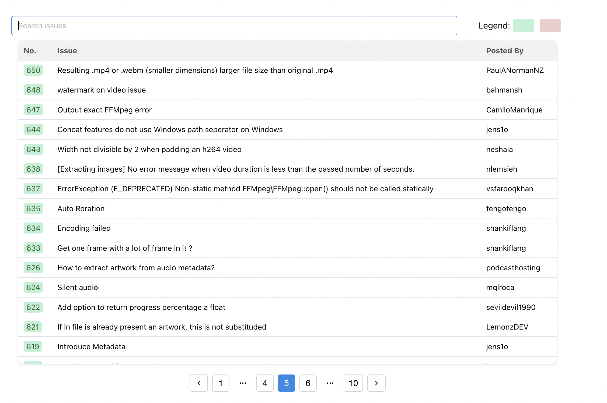

# Edvolve Assessment

This is a frontend assessment with 2 parts:

- [Part 1](#part-1)

  - [Description-1](#description-1)
  - [Live Preview-1](#live-preview-1)
  - [ScreenShot-1](#screenshot-1)

- [Part 2](#part-2)

  - [Description-2](#description-2)
  - [Live Preview-2](#live-preview-2)
  - [ScreenShot-2](#screenshot-2)

- [Author](#author)

## Part 1

### Description-1

Using the [Github Api](https://docs.github.com/en/rest), show all the issues of the [PHP-FFMpeg](https://github.com/PHP-FFMpeg/PHP-FFMpeg) repository in a table and filter the results with the word passed in a textbox. Use React to create the project. No database is required here.

For this submission I utilized [Vite](https://vitejs.dev/) for quick builds, React for the frontend, and [MantineUI](https://mantine.dev/pages/getting-started/) for the styling. I also used the [Axios](https://axios-http.com/) library to handle the API calls.

### [Live Preview-1](https://edvolve-part1.vercel.app/)

### Screenshot-1

## [Part 2](#part-2)

### Description-2

In this one, you are required to replicate the design attached below on React. The design below is a dashboard UI made on Figma. You can use stock images wherever applicable, and you can write any text you feel fit.

### [Live Preview-2]()

### Screenshot-2

## Author

👤 **Manik Rana**
