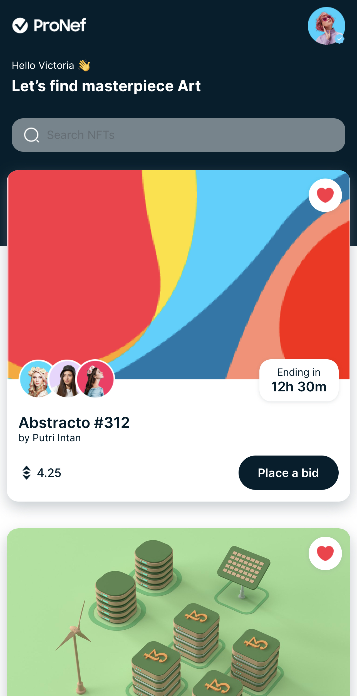

# Bradient: More than just gradients

A react native app that displays gradients and abstract art to add to your next project.

### [App Preview](https://expo.dev/@manikrana/bradient)

### [Landing Page Preview](https://bradient.vercel.app/)

## Landing Page (Using React)

## App (Using React Native)

- [Built with](#built-with)
- [What I Learned](#what-i-learned)
- [Useful Resources](#useful-resources)
- [Author](#author)

## Built with 🛠

* React
* TailwindCSS
* React Native

### Tools

* Visual Studio Code
* Terminal
* Git and GitHub

## What I learned 🎓

* React Native
* TailwindCSS

## Useful Resources 📖

* [React Native Docs](https://reactnative.dev/docs/environment-setup)
* [Expo Docs](https://docs.expo.dev/)

## Author

👤 **Manik Rana**
* GitHub: [Maniktherana](https://github.com/Maniktherana)
