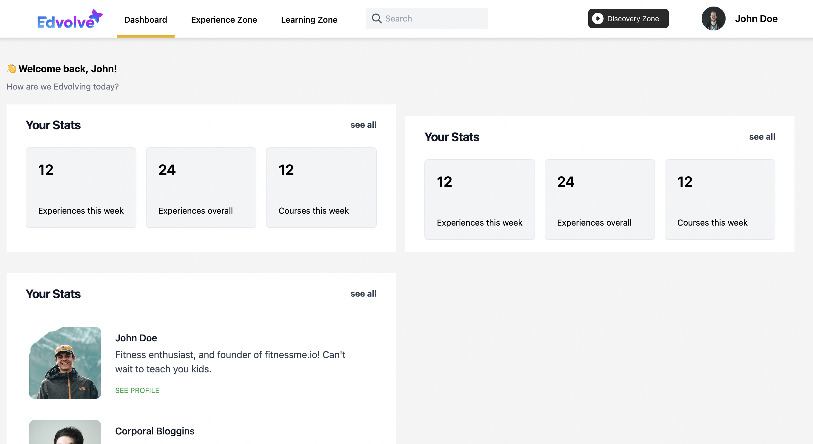
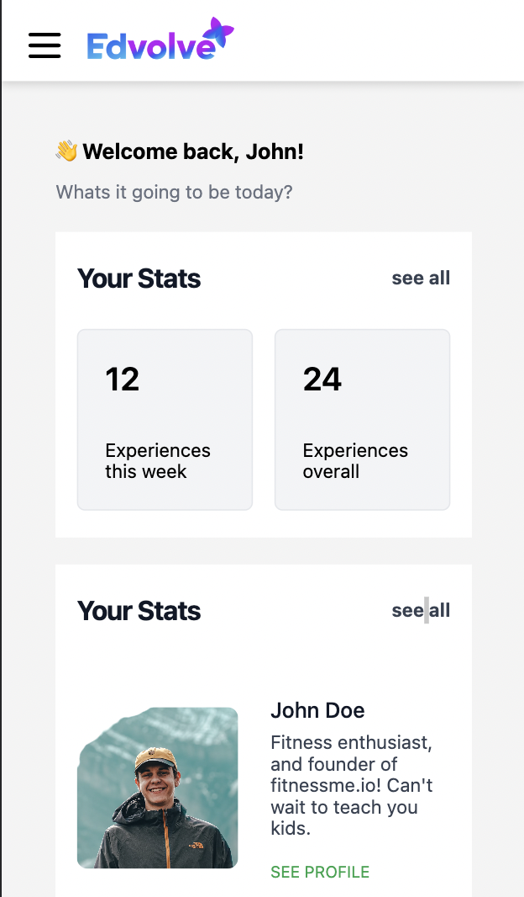

# Edvolve Assessment

This is a frontend assessment with 2 parts:

- [Part 1](#part-1)

  - [Description-1](#description)
  - [Live Preview-1](#live-preview)
  - [ScreenShot-1](#screenshot)

- [Part 2](#part-2)

  - [Description part 2](#description-part-2)
  - [ScreenShots](#screenshots)

- [Author](#author)

## Part 1

### Description

Using the [Github Api](https://docs.github.com/en/rest), show all the issues of the [PHP-FFMpeg](https://github.com/PHP-FFMpeg/PHP-FFMpeg) repository in a table and filter the results with the word passed in a textbox. Use React to create the project. No database is required here.

For this submission I utilized [Vite](https://vitejs.dev/) for quick builds, React for the frontend, and [MantineUI](https://mantine.dev/pages/getting-started/) for the styling. I also used the [Axios](https://axios-http.com/) library to handle the API calls.

### [Live Preview-1](https://edvolve-part1.vercel.app/)

### Screenshot

## [Part 2](#part-2)

### Description part 2

In this one, I had to make a dashboard based off a Figma Layout. I used [Vite](https://vitejs.dev/) for quick builds, React for the frontend, and [TailwindCSS](https://tailwindcss.com/) + [HeadlessUI](https://headlessui.com/) for the styling.

<!-- ### [Live Preview-2]() -->

### Screenshots

## Author

👤 **Manik Rana**
