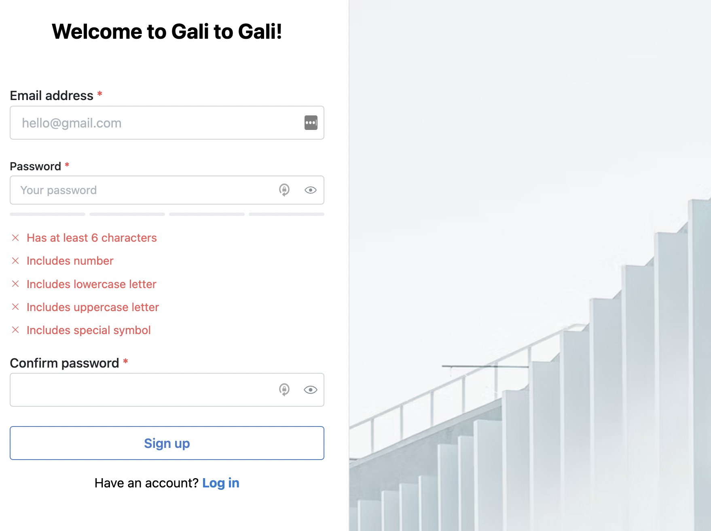

<<<<<<< HEAD

# archives

=======

# G2G frontend assessment

This is an assessment where I was required to make a sign up form in React.

## [Live Preview](https://g2g-frontend-assessment.vercel.app/)

---

## Technologies Used

- Vite
- Typescript
- Mantine UI
- Vercel
- TailwindCSS

## Useful Resources

- [Mantine docs](https://mantine.dev/pages/getting-started/)

## Author

**Manik Rana**

> > > > > > > g2g-frontend-assessment/main
